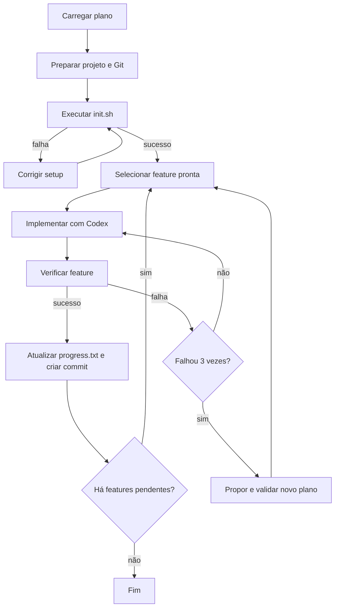

# Development Workflow

Pipeline MHL que usa o Codex CLI para implementar, verificar e registrar em Git uma sequência de features definida por especificações de software.

O workflow aceita tanto projetos novos quanto aplicações existentes. Em um projeto novo, o agente cria uma estrutura mínima em `app/<nome-descritivo>`. Em um projeto existente, ele procura preservar a estrutura e o processo de verificação já adotados.

> **Atenção:** a execução concede ao Codex autonomia para criar e editar arquivos, executar comandos e, após uma verificação bem-sucedida, adicionar e criar commits no repositório-alvo. Execute o workflow apenas em um ambiente versionado e revise previamente as especificações e os prompts.

## Visão geral



O pipeline processa no máximo 15 iterações e mantém checkpoints por etapa durante sete dias. Cada feature também possui limites próprios de tentativas e replanejamento.

## Pré-requisitos

- [MHL CLI](https://github.com/mh-language/mhl-core-runtime) disponível como `mhl` no `PATH`;
- [Codex CLI](https://github.com/openai/codex) instalado e autenticado;
- Git e Bash;
- dependências exigidas pelo projeto-alvo;
- Docker em execução quando as especificações dependerem de serviços locais, como o exemplo de Postgres incluído neste diretório.

### Instalando o MHL

No macOS ou Linux:

```bash
curl -fsSL https://raw.githubusercontent.com/mh-language/mhl-core-runtime/main/install.sh | sh
```

No Windows, execute no PowerShell:

```powershell
irm https://raw.githubusercontent.com/mh-language/mhl-core-runtime/main/install.ps1 | iex
```

O instalador obtém a [versão mais recente](https://github.com/mh-language/mhl-core-runtime/releases), instala o executável em `~/.mhl/bin` — ou `%LOCALAPPDATA%\mhl\bin` no Windows — e adiciona esse diretório ao `PATH`. Quando encontra o VS Code, também instala a extensão `mhl-language`.

Abra um novo terminal e confirme a instalação:

```bash
mhl version
```

As plataformas suportadas atualmente são `linux-amd64`, `darwin-arm64` (macOS com Apple Silicon) e `windows-amd64`. Consulte o [README principal](../README.md#instalando-o-mhl) para as opções de download manual e compilação a partir do código-fonte.

Valide as ferramentas antes de começar:

```bash
mhl version
codex --version
git --version
```

## Preparando as especificações

O diretório `specs/` possui dois papéis:

- `specs/active/`: documentos aprovados usados diretamente na execução;
- `specs/sources/`: material-fonte concatenado e enviado ao planejador quando não há um plano publicado válido.

Por padrão, o workflow procura:

- o plano em `specs/active/40-development-plan.json`;
- o desenho de software em `specs/active/20-software-design-document.md`.

Os arquivos presentes no repositório descrevem uma WebAPI de tarefas em .NET e Postgres e servem como exemplo funcional. Para usar outro projeto, substitua as especificações ativas e as fontes correspondentes.

### Contrato mínimo do plano

O plano deve ser um objeto JSON com uma lista `features`. Cada feature precisa ter identificador numérico, prioridade, dependências, referências rastreáveis e contexto suficiente para implementação isolada:

```json
{
  "features": [
    {
      "id": 1,
      "title": "Criar recurso",
      "priority": 1,
      "dependsOn": [],
      "description": "Comportamento objetivo da feature.",
      "references": ["RF-001", "AC-001"],
      "implementationContext": {
        "requirements": ["Requisito aplicável"],
        "decisions": ["Decisão arquitetural aplicável"],
        "constraints": ["Restrição aplicável"],
        "files": ["src/Feature.cs"],
        "acceptance": ["Critério verificável"]
      },
      "status": "pending"
    }
  ]
}
```

As dependências devem apontar para IDs existentes e formar um grafo acíclico. O workflow limita a importação às dez primeiras features por padrão, ordenadas por prioridade e ID.

## Executando

Os caminhos internos são relativos a este diretório. Portanto, execute os comandos a partir de `development-workflow/`:

```bash
cd development-workflow
mhl lint .
mhl run main.mh
```

Não há parâmetros de entrada obrigatórios. Para continuar uma execução interrompida a partir dos checkpoints:

```bash
mhl run main.mh --resume
```

## O que acontece durante a execução

1. **Start/Plan:** importa o plano publicado. Se ele não estiver disponível, o Codex cria `specs/active/40-development-plan.json` a partir de `specs/sources/`.
2. **Setup:** classifica o trabalho como greenfield ou brownfield, prepara uma branch diferente de `main`/`master` e determina `TARGET_DIR` e `VERIFY_CMD`.
3. **Bearings:** registra o diretório-alvo, o final de `progress.txt` e os commits recentes para orientar a sessão.
4. **Smoke:** executa `<TARGET_DIR>/init.sh`. Em caso de falha, o Codex corrige apenas o bootstrap e o teste é repetido.
5. **Pick:** seleciona a próxima feature pendente cujas dependências já foram concluídas, respeitando prioridade e ID.
6. **Implement:** envia somente o contexto da feature e as decisões arquiteturais relevantes para uma nova execução do Codex.
7. **Verify:** executa `verify-feature.sh <feature-id>` ou, como fallback, o comando agregado configurado em `VERIFY_CMD`.
8. **Fix/Replan:** solicita uma correção localizada após uma falha. A partir da terceira falha consecutiva, pode propor uma revisão completa e validada do plano.
9. **Handoff:** marca a feature como concluída, acrescenta uma linha a `progress.txt`, executa `git add .` e cria um commit no repositório-alvo.

O commit segue o formato:

```text
Feature #<id> - <título>: implementation completed [<resultado>]
```

## Contrato do repositório-alvo

Durante o Setup, o agente deve garantir que estes arquivos existam diretamente em `TARGET_DIR`:

| Arquivo | Responsabilidade |
| --- | --- |
| `init.sh` | Preparar dependências, compilar e, quando necessário, iniciar a aplicação de forma idempotente. Deve falhar com código diferente de zero se o ambiente não ficar pronto. |
| `verify-feature.sh` | Receber um ID de feature e executar uma verificação real. Pode chamar a suíte completa quando não houver testes por feature. |
| `progress.txt` | Manter o histórico resumido das features entregues. É criado pelo handoff se ainda não existir. |
| `logs/smoke.log` | Registrar o comando e a saída detalhada do smoke test. |

`verify-feature.sh` deve imprimir um veredito conciso `PASS` ou `FAIL`, mas o pipeline considera principalmente o código de saída. Verificadores vazios ou que sempre retornam sucesso não atendem ao contrato.

## Configuração e estado gerado

O MHL persiste os dados da execução em `.mhl/`, criado neste diretório. Os principais artefatos são:

| Caminho | Conteúdo |
| --- | --- |
| `.mhl/run_config.json` | Diretório-alvo, comando de verificação e limites da execução. |
| `.mhl/feature_list.json` | Estado corrente das features. |
| `.mhl/plan_observations.json` | Evidências usadas em replanejamentos. |
| `.mhl/plan_revision.json` | Proposta temporária de revisão do plano. |
| `.mhl/session_trace.jsonl` | Eventos de contexto e handoff da sessão. |
| `.mhl/logs/codex.log` | Saída bruta das execuções do Codex CLI. |
| `.mhl/setup_schema.json` | Schema da resposta estruturada do Setup. |

Os limites padrão definidos em `modules/tools/run-config.tool.mh` são:

| Chave | Padrão | Efeito |
| --- | ---: | --- |
| `steps_per_feature` | `6` | Máximo de ciclos de implementação/verificação por feature. |
| `max_replans` | `2` | Máximo de revisões globais do plano. |
| `max_features` | `10` | Número máximo de features importadas ou mantidas. |
| `docs_folder` | `specs/active` | Diretório principal dos documentos aprovados. |

`TARGET_DIR` e `VERIFY_CMD` são definidos pelo Setup. Os demais valores podem ser persistidos no objeto `config` de `.mhl/run_config.json` quando for necessário ajustar uma execução retomada.

## Organização interna

```text
development-workflow/
├── main.mh
├── modules/
│   ├── agents/
│   │   ├── codex.agent.mh       # comando, argumentos e logs do Codex
│   │   ├── codex.adapter.mh     # execução e tratamento de erros
│   │   └── codex.schemas.mh     # schemas das respostas estruturadas
│   ├── prompts/
│   │   ├── setup.prompt.md
│   │   ├── plan.prompt.md
│   │   ├── implement.prompt.md
│   │   ├── fix.prompt.md
│   │   ├── replan.prompt.md
│   │   └── retry-smoke.prompt.md
│   └── tools/
│       ├── feature.tool.mh       # importação, seleção e revisão do plano
│       ├── run-config.tool.mh    # configuração persistente
│       ├── smoke.tool.mh         # bootstrap do projeto
│       ├── verify.tool.mh        # verificação determinística
│       ├── handoff.tool.mh       # progresso e commit
│       ├── bearings.tool.mh      # contexto resumido do repositório
│       ├── implement.tool.mh     # contexto da feature e do design
│       └── session.tool.mh       # memória e rastreamento da sessão
└── specs/
    ├── active/
    └── sources/
```

## Solução de problemas

### `No pending features found`

Confira se `specs/active/40-development-plan.json` contém `features` válidas. Consulte também `.mhl/feature_list.json` para verificar se todas já foram marcadas como concluídas.

### Features pendentes, mas bloqueadas

A mensagem `none are ready (blocked dependencies)` indica dependências inexistentes, ainda não concluídas ou um ciclo no plano. Revise os campos `dependsOn` em `.mhl/feature_list.json` e no plano publicado.

### Falha recorrente no smoke test

Leia `<TARGET_DIR>/logs/smoke.log` e confirme que `init.sh` existe diretamente no diretório-alvo, é idempotente e possui todas as dependências necessárias.

### O Codex não retorna resultado

Verifique a autenticação do Codex CLI e consulte `.mhl/logs/codex.log`. O adaptador espera a saída JSON produzida por `codex exec --json`.

### Nenhum commit foi criado

O handoff não cria commit quando o diretório-alvo não é um repositório Git, não há mudanças preparadas ou o próprio commit falha. A causa é registrada no log do pipeline; `progress.txt` ainda é atualizado em modo best effort.

## Licença

Este workflow faz parte do repositório `mhl-workflows`, disponibilizado sob [CC0 1.0 Universal](../LICENSE).
