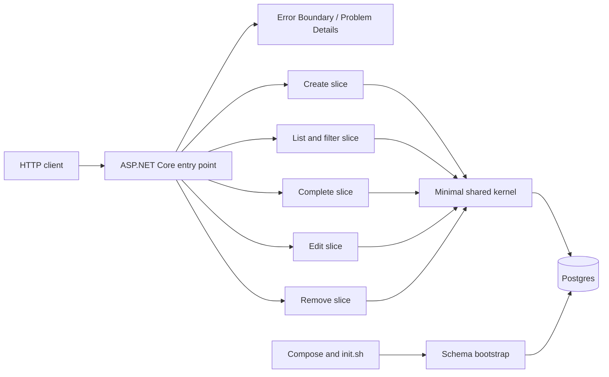

# Software Design Document

## Context and boundaries

TodoApp WebAPI is a greenfield, local and demonstrative HTTP API for one task list. It uses ASP.NET Core, Postgres and Docker Compose. It has no frontend, identity, legacy/JSON migration, cloud, production exposure, multiple services or regulated-data claim. Persistence is guaranteed across API-only restarts while the Postgres volume remains.

## Architecture



Each endpoint owns its HTTP handler, validation, SQL command and mapping. There are no generic Controller/Service/Repository layers. The shared kernel contains only task representation, status values, connection/data-source setup and common error mapping. Npgsql is used directly with parameterized commands.

## Repository shape

```text
TodoApp.sln
├── src/TodoApp.Api/
│   ├── Program.cs
│   ├── Infrastructure/SchemaBootstrap.cs
│   ├── Shared/TaskModel.cs
│   └── Features/
│       ├── CreateTask/
│       ├── ListTasks/
│       ├── CompleteTask/
│       ├── EditTask/
│       └── RemoveTask/
├── tests/TodoApp.UnitTests/
├── tests/TodoApp.IntegrationTests/
├── docker-compose.yml
└── init.sh
```

## Data and HTTP contract

The table stores a Postgres-generated positive integer `id`, normalized `titulo`, and `status` constrained to `pendente` or `concluida`. Creation starts as `pendente`; completion is idempotent; editing never changes status; list queries use ascending id. Empty lists return `[]`.

| Method | Route | Success | Invalid/missing |
|---|---|---|---|
| POST | `/tasks` | 201, task and `Location` | 400 Problem Details |
| GET | `/tasks?status=...` | 200 array | 400 invalid filter |
| PATCH | `/tasks/{id}/complete` | 200 task | 404 Problem Details |
| PUT | `/tasks/{id}` | 200 task | 400/404 Problem Details |
| DELETE | `/tasks/{id}` | 204 no body | 404 Problem Details |

Database unavailability maps to 503 Problem Details without connection strings, credentials, stack traces or driver messages. `TODO_DB_CONNECTION` overrides the connection; absence is allowed to use only the local Compose default.

## Bootstrap and operations

`docker-compose.yml` contains one Postgres service, a persistent volume and healthcheck. API startup applies an idempotent `CREATE TABLE IF NOT EXISTS` schema before serving. `init.sh` brings up Compose, waits for health, starts the API/test flow and returns success only when unit and integration suites pass. Repeated runs must be safe.

## Test strategy

Unit tests cover title trim/validation, status domain, filtering and idempotent completion without HTTP or Postgres. Integration tests call the real HTTP host against real Postgres, run serially, and truncate/reset before each case. Scenarios include fresh schema, all endpoints, invalid inputs, missing ids, repeated completion, API-only restart, connection override, repeated init and sanitized failure responses/logs.

## ADR summary

The decisions below preserve the approved local boundary and allocate every accepted requirement.

## Security and observability

Validate before mutation and use Npgsql parameters. Structured local logs may contain route, status, duration, correlation and failure category, but never payloads, titles, secrets or connection details. No authentication is present; external exposure requires a new refinement.

## Risks and trade-offs

Serial integration sacrifices parallelism for deterministic isolation. There is no pagination, SLA, backup, strong concurrency or high availability. The local unauthenticated boundary is explicit. SDK, image and library versions are pinned at implementation start without changing this design.

## Architecture Decision Records
- **ADR-1** [RF-1, RF-2, RF-3, RF-4, RF-5, RQ-3] Vertical slices with minimal kernel: Organize each endpoint in its own feature slice and keep only genuinely common task/error/configuration types in the kernel. — rationale: Preserves cohesion, traceability and the approved architecture without generic layers.
- **ADR-2** [RF-1, RF-2, RF-3, RF-4, RF-5, RF-6, RF-8] Postgres and direct Npgsql persistence: Use one local Postgres service, a persistent volume and parameterized Npgsql commands. — rationale: Provides real persistence, simple local operation and integration fidelity without mocks.
- **ADR-3** [RF-6, RF-7] Idempotent schema bootstrap: Apply the required table schema at API startup with an idempotent bootstrap before serving requests. — rationale: Supports fresh databases and API recreation while avoiding a mandatory separate migration tool.
- **ADR-4** [RF-1, RF-2, RF-3, RF-4, RF-5, RF-8] Canonical HTTP contract: Use task fields id/titulo/status, pendente/concluida states, ascending-id listing, Problem Details and 503 for dependency unavailability. — rationale: Makes behavior predictable and aligns all slices and acceptance criteria.
- **ADR-5** [RF-6, RF-7, RQ-1] Idempotent local verification: Use Compose healthcheck, init.sh, serial real HTTP/Postgres integration tests and reset before each case. — rationale: Provides reproducible aggregate verification and prevents cross-test contamination.
- **ADR-6** [RF-8, RQ-2] External configuration and sanitized boundary: Read TODO\_DB\_CONNECTION, use only a local default, parameterize SQL and map failures through a sanitized Error Boundary. — rationale: Reduces leakage and injection risks while preserving the local development scope.

## Controls
- **IC-1** [RF-1, RF-3, RF-4, RF-5, RF-8] Input and SQL safety: Validate and normalize before mutation; bind all database values as parameters.
- **IC-2** [RF-6, RF-7] Bootstrap and persistence proof: Healthcheck, idempotent schema, retained volume and API-only restart scenario.
- **IC-3** [RF-2, RQ-1] Deterministic integration isolation: Real HTTP/Postgres, serial execution and cleanup/reset before each case.
- **IC-4** [RF-8, RQ-2] Error and log redaction: Problem Details and logs omit credentials, connection, stack, driver details, payloads and titles.
- **IC-5** [RF-1, RF-2, RF-3, RF-4, RF-5, RQ-3] Structural slice review: Review folder ownership and reject generic controller/service/repository layers.
