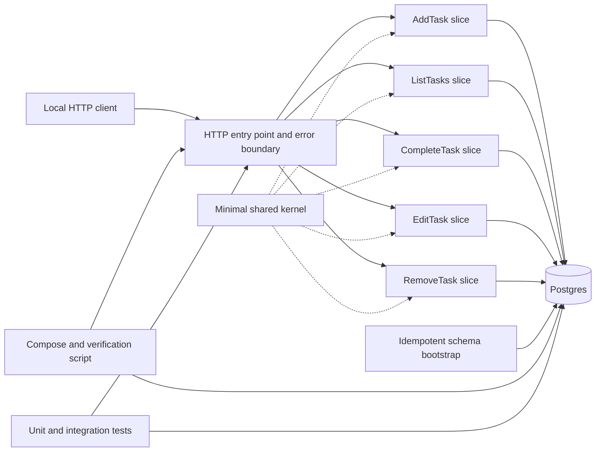
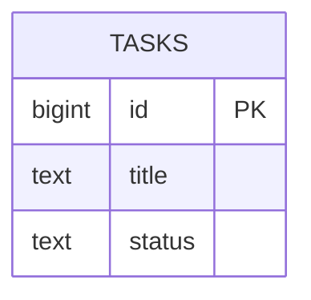

# Software Design Document

## 1. Architectural vision and principles

The system is an ASP.NET Core Web API in .NET/C#, organized around Vertical Slice Architecture. Each operation contains its own HTTP adaptation, rule, SQL, mapping, and tests. Sharing is limited to the task representation and status domain, Postgres data-source creation, configuration, schema bootstrap, and common sanitized error handling.

The design enforces validation before mutation, parameterized SQL, separation of public errors from diagnostics, external configuration, idempotent startup, reproducible verification, and a local greenfield boundary. There is no legacy data, JSON migration, frontend, identity, cloud, production, or external exposure.

## 2. System context and boundaries

The local HTTP client calls the API. The API is the only application component that accesses the Postgres source of truth. Docker Compose starts Postgres with a persistent volume and healthcheck. The API and datastore form the local stack needed by verification; the verification flow waits for database health before starting the API and tests.



## 3. Components and responsibilities

- **API entry point and error boundary:** registers configuration and the singleton data source, installs Problem Details and exception handling, maps routes, dispatches to slices, serializes canonical JSON, and sanitizes expected and unexpected failures. It contains no endpoint-specific SQL or business rule.
- **AddTask slice:** parses `titulo`, trims and validates it, assigns `pendente`, executes a parameterized insert, maps the inserted row, and returns the task with `201` and `Location`.
- **ListTasks slice:** validates the optional `status` query value, selects all tasks or the requested status, orders by ascending `id`, and returns `200` with an array.
- **CompleteTask slice:** parses and validates the positive identifier, executes an idempotent parameterized update through `PATCH /tasks/{id}/complete`, and returns the resulting task. A missing task is `404`; repeating completion remains the documented idempotent success.
- **EditTask slice:** validates the identifier and replacement `titulo` before updating, trims the title, updates only the title, preserves status, and distinguishes `200`, `400`, and `404`.
- **RemoveTask slice:** validates the identifier, executes a parameterized delete, checks affected rows, and returns `204` or sanitized `404`.
- **Shared kernel:** contains the conceptual Task representation, status values `pendente` and `concluida`, the Npgsql data source or connection factory, configuration access, and common error abstractions. It contains no endpoint-specific query or rule.
- **Schema Bootstrap:** runs an idempotent `CREATE TABLE IF NOT EXISTS` definition before database-dependent routes are served. Future schema changes require an explicit evolution strategy and new decision.
- **Postgres and volume:** provide durable storage and database-generated positive increasing identifiers. Removing the volume is outside the durability guarantee.
- **Local orchestration:** Compose owns Postgres, the healthcheck, and the volume. `init.sh` owns readiness waiting and the aggregate verification command and is safe to run repeatedly.
- **Unit tests:** exercise pure validation, normalization, state, filtering, and mapping functions without HTTP or Postgres.
- **Integration tests:** use xUnit, a test ASP.NET host, `HttpClient`, and real Compose-managed Postgres. Tests are serial and clean the table and identity sequence before each case.

## 4. Interactions, flows, and dependencies

### Startup

Compose starts the pinned Postgres image and reports healthy only after its healthcheck succeeds. The API reads `TODO_DB_CONNECTION`, falling back only to the documented local default when appropriate, creates one singleton `NpgsqlDataSource`, applies the idempotent schema bootstrap, and then serves routes. Database failures cross the error boundary and become sanitized `503` Problem Details.

### Create and query

A request enters the owning slice. The slice validates and normalizes all client input before a mutable database operation. `POST /tasks` inserts a pending task and returns the canonical representation. `GET /tasks` returns all tasks ordered by ascending `id`; `GET /tasks?status=pendente` and `GET /tasks?status=concluida` return only the selected state. An invalid filter is rejected with `400` and no data array.

### Complete, edit, and remove

`PATCH /tasks/{id}/complete` updates status to `concluida` and returns the task; the update is idempotent for an already completed task. `PUT /tasks/{id}` trims and validates `titulo`, changes only the title, and preserves status. `DELETE /tasks/{id}` removes the row and returns `204` with no body. Update and delete affected-row checks produce `404` for a missing task without unintended mutation.

### Verification

`init.sh` runs `docker compose up -d --wait`, then one solution-level command that runs both unit and integration suites. The command propagates non-zero failure and does not infer success from text output. Integration tests run individually, as a suite, and twice consecutively; they use a dedicated test connection to truncate `tasks` and reset its identity sequence before each case. The persistence scenario recreates the API host while retaining Postgres and its volume.

Dependencies are a pinned supported .NET LTS SDK, ASP.NET Core, Npgsql, xUnit, Microsoft.NET.Test.Sdk, the ASP.NET test host, Postgres, and Docker Compose. The exact versions are recorded in `global.json`, project files, and Compose during implementation.

### 4.1 C#/.NET implementation instructions

Use the selected supported .NET LTS version and record the exact SDK in `global.json`. Enable nullable reference types, implicit usings, deterministic builds, and repository-appropriate analyzers. Treat warnings as errors once the clean baseline is established.

Recommended layout:

```text
app/
  TodoApp.sln
  Directory.Build.props
  global.json
  docker-compose.yml
  init.sh
  verify-feature.sh
  src/
    TodoApp.Api/
      Program.cs
      Features/
        AddTask/
        ListTasks/
        CompleteTask/
        EditTask/
        RemoveTask/
      Infrastructure/
        Database/
        Errors/
      Domain/
  tests/
    TodoApp.UnitTests/
      Features/
    TodoApp.IntegrationTests/
      Fixtures/
```

`Program.cs` is composition only: configuration, registration, middleware, startup orchestration, and route mapping. Npgsql is the only database driver. Register one singleton `NpgsqlDataSource`; each slice creates and disposes its own command and reader. Do not add Entity Framework Core, Dapper, MediatR, a generic repository, or a generic service layer without a new decision.

Every slice must parse and validate before opening a mutable operation, trim `titulo`, reject an empty result, use `long` for the public `id`, parameterize every input, use asynchronous disposal and the request cancellation token, check affected-row counts, and map database rows explicitly to only `id`, `titulo`, and `status`. Status values live in the shared domain while endpoint-specific rules remain local.

### Configuration and schema

Read `TODO_DB_CONNECTION` through configuration. A local-development default may be used only for the explicitly local Compose setup; credentials are never hardcoded in source, tests, or Compose. The bootstrap applies the initial table definition idempotently before serving database-dependent routes.

The logical table is `tasks`: `id bigint generated by identity primary key`, `title text not null`, and `status text not null` constrained to `pendente` or `concluida`. The database constraint also rejects a title that is empty after trimming. The public JSON field is `titulo`, mapped explicitly to persisted column `title`. There are no user, date, priority, version, audit, or history columns.

## 5. Conceptual data model



`id` is a positive Postgres-generated 64-bit integer. `title` is normalized non-empty text. `status` is a required value in the two-value domain. Listing orders by `id`; deletion is physical. The Compose volume retains data across an API-only restart, with no backup or external retention guarantee.

## 6. Contracts and specification-level interfaces

Creation and edit requests use `application/json` with a textual `titulo` field. Successful task representations use `application/json` and exactly `id`, `titulo`, and `status`, where status is `pendente` or `concluida`. Errors use `application/problem+json` with stable `type`, `title`, `status`, `detail`, and `instance`; public detail is sanitized.

| Operation | Success | Client failure | Design behavior |
|---|---|---|---|
| `POST /tasks` | `201`, task body, `Location` | `400` for invalid title | AddTask normalizes, persists pending, and returns the created task |
| `GET /tasks` | `200` ordered array | `400` for invalid status filter; `503` for unavailable database | ListTasks supports no filter and both status values |
| `GET /tasks?status=pendente` or `GET /tasks?status=concluida` | `200` filtered array | `400` for any other value | The filter is validated before SQL |
| `PATCH /tasks/{id}/complete` | `200` completed task, including repeated completion | `400` for invalid id; `404` for missing task | CompleteTask performs an idempotent update |
| `PUT /tasks/{id}` | `200` updated task | `400` for invalid id/title; `404` for missing task | EditTask changes title and preserves status |
| `DELETE /tasks/{id}` | `204` with no body | `400` for invalid id; `404` for missing task | RemoveTask checks affected rows |

All database operations are parameterized and owned by their slice. No Repository abstraction is introduced. An unavailable dependency is mapped to sanitized `503` Problem Details.

## 7. Architectural decisions

- **ADR-1 — Vertical slices per endpoint.** Keep HTTP handling, rules, SQL, mapping, and tests together for each operation. This maximizes cohesion and traceability at the cost of intentional small duplication; layered and generic alternatives would add indirection and coupling.
- **ADR-2 — .NET/C# and ASP.NET Core.** Use the mandatory ecosystem and pin a supported LTS SDK. This keeps the local stack consistent while requiring explicit version documentation.
- **ADR-3 — Direct Npgsql per slice.** Use the official driver with explicit commands and mapping. This avoids an accidental shared persistence layer and trades framework convenience for visible SQL and more mapping code.
- **ADR-4 — Postgres in Docker Compose.** Use one pinned Postgres service, healthcheck, and persistent volume. This provides real persistence and integration fidelity at the cost of a Docker dependency.
- **ADR-5 — API-owned idempotent schema bootstrap.** Apply the initial table definition with `CREATE TABLE IF NOT EXISTS` at startup. This works against a fresh database or retained volume; future schema evolution needs a new explicit strategy.
- **ADR-6 — Minimal shared kernel.** Share only the task/status domain, data-source creation, configuration, and common errors. This prevents generic Controller, Service, and Repository layers while requiring structural review to prevent kernel growth.
- **ADR-7 — Two-level xUnit verification.** Use pure unit tests for rules and real HTTP/Postgres integration tests for the contract and lifecycle. This gives fast diagnosis plus infrastructure confidence without mocks or in-memory persistence.
- **ADR-8 — Serial integration isolation.** Use a non-parallel collection and truncate/reset before each test case. This is deterministic and simple for the small local scope, at the cost of parallel throughput.
- **ADR-9 — Environment-based configuration.** Read `TODO_DB_CONNECTION` and permit only a documented local default. This supports repeatable local execution while leaving secret management outside the scope.
- **ADR-10 — Canonical JSON and Problem Details.** Stabilize `id`, `titulo`, `status`, status values, HTTP outcomes, and sanitized error fields. This improves interoperability and requires regression tests for serialization and redaction.

## 8. Requirement allocation to components

| Component | Allocated requirements | Implementation responsibility |
|---|---|---|
| API entry point and error boundary | RF-6, RF-8, RF-9, RQ-4 | Route registration, configuration, Problem Details, exception mapping, redaction, and aggregate startup behavior |
| AddTask slice | RF-1, RF-6, RQ-1, RQ-2 | `POST /tasks`, title validation/normalization, pending creation, parameterized insert, response, and tests |
| ListTasks slice | RF-2, RF-6, RQ-1, RQ-2 | `GET /tasks`, status validation, ordered/filtering query, response, and tests |
| CompleteTask slice | RF-3, RF-6, RQ-1, RQ-2 | `PATCH /tasks/{id}/complete`, idempotent completion, missing-id behavior, and tests |
| EditTask slice | RF-4, RF-6, RQ-1, RQ-2 | `PUT /tasks/{id}`, title validation, status preservation, and tests |
| RemoveTask slice | RF-5, RF-6, RQ-1, RQ-2 | `DELETE /tasks/{id}`, affected-row check, and tests |
| Shared kernel and configuration | RF-7, RF-9, RQ-1, RQ-4 | Task/status domain, Npgsql data source, environment configuration, and common sanitized errors |
| Schema Bootstrap and Postgres | RF-7, RF-9, RQ-3 | Idempotent table creation, constraints, identity generation, parameterized access, and retained volume |
| Compose and verification flow | RF-8, RF-9, RQ-2, RQ-3, RQ-4 | Healthcheck, pinned service/volume, readiness, aggregate command, repeatability, and safe output |
| Unit and integration tests | RF-1, RF-2, RF-3, RF-4, RF-5, RF-6, RF-7, RF-8, RQ-2, RQ-3, RQ-4 | Complete lifecycle coverage, restart durability, isolation, failure mapping, and response/log assertions |

Every RF-1 through RF-9 and RQ-1 through RQ-4 is allocated to at least one implementing component and ADR.

## 9. Quality, security, and operational controls

- Correctness comes from slice-local validation, database constraints, explicit row mapping, affected-row checks, and contract tests.
- Reliability comes from validation before mutation, idempotent bootstrap, positive healthchecks, retained volumes, serial isolation, and failure-propagating scripts.
- Maintainability comes from visible endpoint folders, local SQL, a small kernel, pinned dependencies, and endpoint-by-endpoint review.
- There is no latency, throughput, scale, pagination, availability, backup, or production claim.
- Parameterization controls injection. Configuration is external and credentials are redacted. Titles are not logged by default.
- The API has no users, sessions, tokens, or authorization and must remain local; external exposure, regulated data, and multiple users require a new refinement.
- The error boundary never copies a connection string, credential, SQL statement, driver message, stack trace, or unrelated internal data into Problem Details or logs.

## 10. Preliminary threat model

| Threat | Design control | Residual risk |
|---|---|---|
| Injection | Input validation and Npgsql parameters for every value | Implementation defects, addressed by review and tests |
| Partial or unintended mutation | Validate first, atomic command, and affected-row checks | Last-write-wins concurrency is outside the local scope |
| Error leakage | Central sanitized Problem Details and redacted diagnostics | Local operational review remains necessary |
| Credential exposure | `TODO_DB_CONNECTION`, local-only default, and no credential logging | No external secret manager is provided |
| Unauthorized access | Local boundary and explicit non-production documentation | Accidental network exposure requires operator care |
| Sensitive title logging | Do not log request payloads or titles | The non-sensitive demonstration assumption must be maintained |
| Volume loss | State durability is explicitly limited to a retained volume | No backup/restore guarantee |

## 11. Verification strategy

Unit tests cover title normalization, required-title validation, identifier validation, status values, filtering, completion idempotency, status preservation, affected-row decisions, and explicit mapping without HTTP or Postgres.

Integration tests use `HttpClient` against the test ASP.NET host and real Postgres. They cover creation, ordered listing, both filters, invalid filter, completion and repeated completion, editing pending and completed tasks, removal, invalid inputs, missing tasks, fresh schema setup, connection override, sanitized dependency failure, and API-host recreation with the database volume retained. Tests assert status codes, response bodies, content types, `Location`, no-body behavior, database state, and absence of credentials/SQL/stack traces in public output and logs.

The integration collection is non-parallel. Before each case, a dedicated connection truncates `tasks` and resets the identity sequence; the persistence case deliberately retains data while recreating only the API host. The same solution-level command is used by developers and `verify-feature.sh`. Any failing suite yields a non-zero aggregate result.

## 12. Readiness and implementation handoff

Development may begin with the pinned .NET solution, Compose-managed Postgres, schema bootstrap, shared kernel, five endpoint slices, and the defined test flow. The implementation must prove fresh and retained-volume startup, Unicode titles, idempotent completion, restart durability, isolation, and sanitized database failures.

The following increments are independently demonstrable: postgres-infrastructure; add-task; list-filter-tasks; complete-task; edit-task; remove-task; and persistence-resilience. Each increment preserves the vertical-slice boundary and depends only on the infrastructure or earlier endpoint behavior required by the contract. No increment adds migration, frontend, identity, cloud, CI, production exposure, generic layers, pagination, SLA, backup, or regulated-data support.

## Architecture Decision Records
- **ADR-1** [RQ-1, RF-1, RF-2, RF-3, RF-4, RF-5, RF-6] Vertical slices per endpoint: Keep HTTP handling, validation, SQL, mapping, and tests in the slice that owns each operation. — rationale: Preserves cohesion and endpoint traceability while avoiding generic layers and their coupling.
- **ADR-2** [RF-1, RF-2, RF-3, RF-4, RF-5, RF-8] .NET/C\# and ASP.NET Core: Use the mandatory .NET/C\# ASP.NET Core stack and pin a supported LTS SDK. — rationale: Provides one consistent implementation and test ecosystem within the approved boundary.
- **ADR-3** [RF-1, RF-2, RF-3, RF-4, RF-5, RF-6, RF-7, RF-9, RQ-2] Direct Npgsql per slice: Use one singleton NpgsqlDataSource and explicit parameterized commands owned by each slice. — rationale: Keeps SQL and mapping visible and avoids a generic persistence abstraction while using real Postgres.
- **ADR-4** [RF-7, RF-8, RQ-2, RQ-3] Postgres in Docker Compose: Run one pinned Postgres service with healthcheck and persistent volume as the local datastore. — rationale: Provides real persistence and integration fidelity with reproducible local setup.
- **ADR-5** [RF-7, RF-8, RQ-3] API-owned idempotent schema bootstrap: Apply the initial tasks table definition at API startup with an idempotent bootstrap. — rationale: Supports fresh and retained databases without manual setup; later evolution remains an explicit decision.
- **ADR-6** [RQ-1, RF-7, RF-9, RQ-4] Minimal shared kernel: Share only task/status domain types, data-source creation, configuration, and common errors. — rationale: Prevents endpoint-specific rules and queries from becoming shared coupling.
- **ADR-7** [RQ-2, RF-1, RF-2, RF-3, RF-4, RF-5, RF-6, RF-7] Two-level xUnit verification: Use pure unit tests plus real HTTP/Postgres integration tests. — rationale: Combines fast rule diagnosis with contract and persistence confidence without mocks or in-memory storage.
- **ADR-8** [RQ-2, RQ-3, RF-7, RF-8] Serial integration isolation: Run integration tests in a non-parallel collection and truncate/reset before each case. — rationale: Provides deterministic repeated runs for the small local scope.
- **ADR-9** [RF-8, RF-9, RQ-4] Environment-based configuration: Read TODO\_DB\_CONNECTION and provide only a documented local default. — rationale: Enables repeatable local execution without hardcoded credentials or source-controlled secrets.
- **ADR-10** [RF-1, RF-2, RF-3, RF-4, RF-5, RF-6, RQ-4] Canonical JSON and Problem Details: Stabilize id, titulo, status, status values, HTTP outcomes, and sanitized application/problem+json errors. — rationale: Improves interoperability and makes failure behavior testable without exposing internal details.

## Controls
- **IC-1** [RF-1, RF-3, RF-4, RF-6, RQ-1] Slice-local validation: Validate identifiers, titles, filters, and state conditions before any mutation, then normalize titulo with Trim().
- **IC-2** [RF-1, RF-2, RF-3, RF-4, RF-5, RF-6, RF-7, RF-9] Parameterized persistence: Use Npgsql parameters for every client-supplied database value and explicit row mapping.
- **IC-3** [RF-7, RF-8, RQ-3] Idempotent schema and durable volume: Bootstrap the tasks table with an idempotent definition and retain the Compose volume across API-only restarts.
- **IC-4** [RF-1, RF-2, RF-3, RF-4, RF-5, RF-6] Canonical HTTP contract: Expose the documented task fields, route methods, status values, success codes, Location header, and empty-body delete response.
- **IC-5** [RF-6, RF-9, RQ-4] Sanitized failure boundary: Map dependency, validation, not-found, conflict, and unexpected failures to stable Problem Details without credentials, SQL, driver details, stack traces, or task content beyond the contract.
- **IC-6** [RQ-2, RQ-3, RF-1, RF-2, RF-3, RF-4, RF-5, RF-7] Real isolated verification: Run pure rule tests and real HTTP/Postgres integration tests serially, with table truncation and identity reset before each test case.
- **IC-7** [RF-7, RF-8, RQ-3] Readiness and aggregate execution: Have init.sh wait for a healthy pinned Postgres, start the API with schema ready, run both suites, and propagate failure through its exit code.
- **IC-8** [RF-9, RQ-4] Configuration and log redaction: Read TODO\_DB\_CONNECTION with a local-only default and keep credentials, request titles, and raw database exceptions out of source-controlled output and logs.
