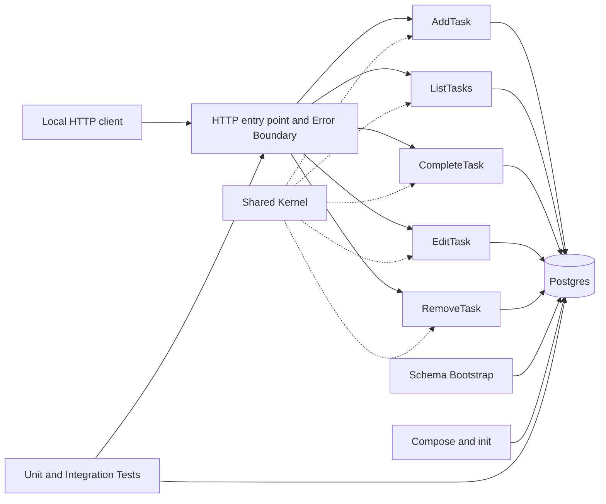
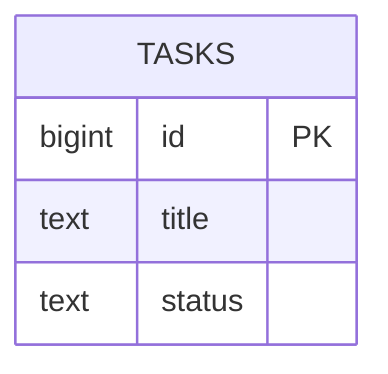

<!-- generated-by: Flows.Refinement -->
<!-- refinement_run_id: 7ee5e9dc-bfbd-4d1b-8000-1a472c5e35a0 -->
<!-- published_at: 2026-07-28T02:35:42Z -->
<!-- status: approved -->
<!-- source_files: 202607211323-todo-app-brief.md,adr-0001-vertical-slice.md,c4-diagrama-componentes.md,todoapp-refinement-decisions.md -->

> **Notice:** this document was generated automatically by the refinement flow
> (`Flows.Refinement`) and approved by the flow's own deterministic review gate
> (the `review` command with a `READY` verdict). It does NOT represent explicit
> human approval — unless a human approval is recorded in the content below —
> because this MVP does not collect formal human approval before publication.
# Software Design Document — TodoApp WebAPI

## 1. Architectural vision and principles
An ASP.NET Core Web API in .NET/C#, organized around Vertical Slice Architecture. Each operation contains its own HTTP adaptation, rule, and SQL. Sharing is limited to the entity/status, Postgres connection creation, and common errors. Principles: cohesion per use case; validation before mutation; parameterized SQL; public errors kept separate from diagnostics; external configuration; idempotent startup; real/reproducible verification; a local, greenfield boundary.

## 2. System context and boundaries
Local HTTP client → WebAPI → Postgres. The API runs on the development/test host; Docker Compose manages only Postgres/the volume. `init.sh` brings up/waits for the database and runs the test solution. There is no legacy data, frontend, identity, cloud, CI, or production.



## 3. Components and responsibilities
- **API Entry Point/Error Boundary:** registers routes, dispatches to the slice, serializes JSON/Problem Details, and sanitizes failures; contains no business rule or generic data access.
- **AddTask:** parses `titulo`, applies trimming/validation, sets `pendente`, inserts the record, and returns the task/Location.
- **ListTasks:** validates the filter, selects all tasks or those matching a status, and orders by id.
- **CompleteTask:** locates the task and updates its status idempotently.
- **EditTask:** validates the title before the update and preserves the status.
- **RemoveTask:** deletes by id and distinguishes a missing task.
- **Shared Kernel:** the conceptual `Task`, the status domain, `NpgsqlDataSource`/connection factory, and common errors; contains no endpoint-specific query or command.
- **Schema Bootstrap:** on API startup, runs the idempotent table definition before mapping/serving database-dependent routes.
- **Postgres/volume:** the source of truth and id generation.
- **Local orchestration:** Compose with a single Postgres instance, volume, and healthcheck; an idempotent script.
- **Unit Tests:** pure rules extracted into internal functions/objects within each slice, with no HTTP/database involved.
- **Integration Tests:** xUnit + a test ASP.NET host + `HttpClient` + a real Postgres; cleanup is exclusive per test case.

## 4. Interactions, flows, and dependencies
### Startup
Compose brings up Postgres and the healthcheck turns positive. The API creates an `NpgsqlDataSource` using `TODO_DB_CONNECTION`; Schema Bootstrap runs its idempotent definition; routes then start serving requests. A database failure reaches the Error Boundary and produces a sanitized `503`.

### Operations
Request → slice → validation → parameterized SQL command → mapping → response. Validation completes before any mutable connection is used. Updates/deletes check the affected row count to distinguish a `404`. Listing applies the validated filter and orders by id. Completion sets `concluida` even if the task is already in that state.

### Verification
`init.sh` runs `docker compose up -d --wait` followed by the solution's single command. Unit tests run with no dependencies. Integration tests are non-parallel; before each test case, the table is truncated and its sequence reset via a test connection. The API host is recreated for the persistence scenario while the database/volume remain in place.

Dependencies: a supported .NET LTS SDK pinned in the repository, ASP.NET Core, the Npgsql driver, xUnit, Postgres with a pinned image, and Docker Compose. Exact versions are recorded during initial implementation, per RF-11.

### 4.1 C#/.NET implementation instructions

The implementation must use the selected supported .NET LTS version and record
the exact SDK in `global.json`. The solution and projects must enable nullable
reference types, implicit usings, deterministic builds, and compiler/analyzer
warnings appropriate for the repository. Treat warnings as errors in CI or in
the verification script once the baseline is clean; do not suppress a warning
without documenting the reason.

Recommended solution layout:

```text
app/
  TodoApp.sln
  Directory.Build.props
  global.json
  docker-compose.yml
  init.sh
  verify-feature.sh  
  src/
    TodoApp.Api/
      Program.cs
      Features/
        AddTask/
        ListTasks/
        CompleteTask/
        EditTask/
        RemoveTask/
      Infrastructure/
        Database/
        Errors/
      Domain/
  tests/
    TodoApp.UnitTests/
      Features/
    TodoApp.IntegrationTests/
      Fixtures/
```

The exact project names may vary, but the vertical-slice boundary must remain
visible in the filesystem and namespaces. `Program.cs` is limited to
composition: configuration, dependency registration, middleware, route
mapping, and startup orchestration. It must not contain feature-specific SQL
or business rules.

#### Required dependencies and boundaries

- **ASP.NET Core** supplies the Web API host, routing, JSON serialization,
  Problem Details, and dependency injection.
- **Npgsql** is the only database driver. Register one singleton
  `NpgsqlDataSource` (or an equivalent shared connection factory) and let each
  slice create and dispose its own command/reader.
- **xUnit**, `Microsoft.NET.Test.Sdk`, and the test runner package provide unit
  and integration tests.
- **Microsoft.AspNetCore.Mvc.Testing** (or the equivalent ASP.NET test host)
  provides an in-process `HttpClient` for the integration suite.
- **Postgres and Docker Compose** provide the real database used by local and
  integration verification; an in-memory database, JSON file, or mock-only
  persistence path is not an acceptable substitute.

Do not add Entity Framework Core, Dapper, MediatR, a generic repository, or a
generic service layer unless a new ADR explicitly changes the design. The
current design intentionally keeps SQL and mapping close to the operation that
owns them.

#### Slice implementation rules

Each feature folder should contain the route/handler, request and response
types, validation, SQL, and row mapping needed by that operation. A slice must:

1. parse and validate input before opening a mutable database operation;
2. normalize `titulo` with `Trim()` and reject empty results;
3. use `long` for the public `id` and parameterized `NpgsqlCommand` values for
   every input;
4. use `await`, `await using`, and the request cancellation token for database
   calls;
5. check affected-row counts for update and delete operations so a missing
   task becomes `404`;
6. map database rows explicitly to the public representation, exposing only
   `id`, `titulo`, and `status`; and
7. keep status values in shared constants or a small domain type, while
   keeping endpoint-specific rules inside the owning slice.

Prefer typed minimal-API results or explicit `IResult` branches so every
endpoint's `201`, `200`, `204`, `400`, `404`, and `503` behavior is apparent in
the code. Use `Created` with a `Location` header for creation, and return
`ProblemDetails` for client and dependency errors. Never copy a raw exception,
connection string, SQL statement, or driver message into an HTTP response.

#### Configuration and startup

Read `TODO_DB_CONNECTION` through `IConfiguration`; provide a documented
local-development default only when the environment is explicitly local. Do
not hardcode credentials in source, tests, or Compose files. Register the
`NpgsqlDataSource` once, run the schema bootstrap through an idempotent startup
component, and only then expose database-dependent routes. The bootstrap may
use `CREATE TABLE IF NOT EXISTS` for this greenfield baseline, but any schema
change after the first implementation requires a new explicit migration
strategy and ADR.

Keep Docker Compose responsible for Postgres readiness, volume persistence, and
the healthcheck. Keep `init.sh` responsible for `docker compose up -d --wait`
and the complete verification command; it must be safe to run repeatedly.

#### Testing and verification requirements

- Unit-test validation, normalization, status transitions, and mapping without
  HTTP or a database.
- Integration-test the public HTTP contract with `HttpClient` and a real
  Postgres instance, including invalid input, missing ids, ordering, idempotent
  completion, persistence after API-host recreation, and sanitized `503`
  responses.
- Keep integration tests in a non-parallel xUnit collection. Truncate `tasks`
  and reset its identity sequence before each case using a dedicated test
  connection; do not rely on test ordering.
- Run the same solution-level command from `verify-feature.sh` that developers
  use locally. The script must return a non-zero exit code on any failure and
  must not treat textual `PASS` output as evidence of success.
- Keep database credentials, task titles, and raw driver exceptions out of
  logs. Tests should assert both response bodies and status codes, including
  the `application/problem+json` content type for errors.

Implementation is complete only when the solution builds with the pinned SDK,
the full unit/integration suite is green against the real Compose-managed
Postgres, repeated `init.sh` runs are safe, and every endpoint in Section 6 is
covered by an executable verification path.

## 5. Conceptual data model
Logical table `tasks`:
- `id`: a positive 64-bit integer, primary key, generated as an identity by Postgres;
- `title`: required text, with a constraint that rejects an empty value after trimming;
- `status`: required text limited to `pendente` or `concluida`.

There is no user, date, priority, version, or audit column. Listing orders by id. `DELETE` physically removes the row. The volume retains data across API restarts; there is no external backup/retention.



## 6. Contracts and specification-level interfaces
- Creation/edit input: `application/json` JSON with a textual `titulo` field.
- Representation: an integer `id`, a normalized textual `titulo`, and `status` of `pendente`/`concluida`.
- Error: `application/problem+json` with `type`, `title`, `status`, `detail`, and `instance`; `detail` is public/sanitized.
- `POST /tasks`: `201`, the task body, and `Location` pointing to the conceptual resource; `400` if invalid.
- `GET /tasks`: `200` array ordered by id; optional `status` query; `400` if invalid.
- `PATCH /tasks/{id}`: `200` with the task; `404` if missing.
- `PUT /tasks/{id}`: `200` with the task; `400` if invalid; `404` if missing.
- `DELETE /tasks/{id}`: `204`; `404` if missing.
- Unavailable dependency: `503` Problem Details.
- Persistence: each slice owns its own parameterized SQL and requests a connection from the shared data source; there is no Repository.

## 7. Architectural decisions
- **ADR-001 — Vertical slices per endpoint.** Choice: HTTP, rule, and data specifics co-located. Alternatives: layered and Clean/Onion architectures, rejected in the original ADR due to coupling/indirection. Trade-off: cohesion and isolated evolution versus intentional duplication.
- **ADR-002 — .NET/C# and ASP.NET Core.** Choice: the mandatory stack; the implementation must pin a supported LTS version. Alternatives: other runtimes, out of scope. Trade-off: a single ecosystem versus specific skills/versioning.
- **ADR-003 — Npgsql directly per slice.** Choice: the official driver with explicit commands/mapping in each slice. Alternatives: Dapper reduces boilerplate but adds abstraction; EF Core adds conventions/tracking and risks a shared layer. Trade-off: control/consistency with slices versus more mapping code.
- **ADR-004 — A single Postgres in Docker Compose.** Choice: a real database/volume/healthcheck. Alternatives: in-memory/JSON do not support integration testing; managed/cloud Postgres is out. Trade-off: fidelity versus a dependency on Docker/readiness.
- **ADR-005 — Idempotent bootstrap by the API.** Choice: a startup component runs the initial versioned table definition if it is missing. Alternatives: a container init script only acts on a fresh volume; a dedicated tool is unnecessary for this small greenfield project. Trade-off: works against any empty database and simplifies setup, but future changes will require an explicit evolution strategy.
- **ADR-006 — Minimal shared kernel.** Choice: the entity/status, data source, and common errors. Alternatives: a generic Service/Repository introduces coupling; duplicating the data source scatters configuration. Trade-off: a centralized cross-cutting layer with no shared rules, requiring disciplined review.
- **ADR-007 — xUnit at two levels.** Choice: pure unit tests per slice plus integration tests with a real HTTP/Postgres host. Alternatives: mocks alone do not validate the database; integration tests alone reduce speed/diagnosability. Trade-off: confidence versus additional setup.
- **ADR-008 — Serial integration with truncate/reset.** Choice: a non-parallel collection with the table/sequence cleaned before each case. Alternatives: an external transaction does not easily span HTTP calls; a database per test is slower. Trade-off: simple determinism versus reduced parallelism.
- **ADR-009 — Environment-based configuration.** Choice: `TODO_DB_CONNECTION` with a local-only default. Alternatives: insecure/inflexible hardcoding; a secret manager, out of scope. Trade-off: simple reproducibility versus protection limited to the local environment.
- **ADR-010 — Problem Details and a canonical JSON contract.** Choice: the contract defined in the SRS, ASCII values for status, and `503` for database issues. Alternatives: ad hoc errors/500 are less semantic and consistent. Trade-off: interoperability versus the need to keep serialization stable.

## 8. Requirement allocation to components
| Target | Allocated requirements |
|---|---|
| Entry Point/Error Boundary | RF-1 to RF-7; RQ-5 |
| AddTask | RF-1; RQ-4, RQ-5 |
| ListTasks | RF-2, RF-3; RQ-4, RQ-5 |
| CompleteTask | RF-4; RQ-4, RQ-5 |
| EditTask | RF-5; RQ-4, RQ-5 |
| RemoveTask | RF-6; RQ-4, RQ-5 |
| Shared Kernel/configuration | RF-9; RQ-4 |
| Schema Bootstrap | RF-8; RQ-3 |
| Postgres/slice SQL | RF-1 to RF-8; RQ-1, RQ-4 |
| Compose/init | RF-10; RQ-2, RQ-3 |
| Unit/Integration Tests | RF-10, RF-11; RQ-1, RQ-2, RQ-3, RQ-5 |
| Documentation/versions | RF-9; RQ-4, RQ-5 |

Every RF-1 through RF-11 and RQ-1 through RQ-5 has a target. Validation and error rules are realized within the corresponding slices and the shared error boundary.

## 9. Approach to quality attributes
- **Correctness:** invariants in rules and constraints; affected-row checks detect missing records; the contract is covered by integration tests.
- **Reliability:** validation before mutation, idempotent bootstrap, readiness checks, and an aggregate result.
- **Maintainability:** one folder/namespace per endpoint, SQL local to each slice, and an auditable kernel.
- **Reproducibility:** pinned versions, Compose, environment configuration, and a single script.
- **Availability:** no SLO/HA; an unavailable dependency fails fast with `503`; automatic retry is not required.
- **Performance:** no SLA/volume target; key-based ordering and simple queries suit the demonstration, with no scale claim.
- **Security/privacy:** parameterization, external connection configuration, the Error Boundary, logs without titles/secrets, and local-only use.

## 10. Preliminary threat model
Assets: task integrity/availability, title content, and the connection string. Boundaries: client→API, API→Postgres, environment→configuration.

| Threat | Design control | Residual risk |
|---|---|---|
| Injection | validation + Npgsql parameters | implementation bugs, covered by review/tests |
| Partial mutation | validate first + atomic command | last-write-wins concurrency is not a requirement |
| Leakage in errors | sanitized Error Boundary/Problem Details | local logs must be reviewed |
| Exposed credentials | environment configuration and redaction | external secret management is out of scope |
| Unauthorized access | local documentation/execution | accidental exposure requires operational care |
| DoS via volume | local boundary, no SLA | limits/pagination absent by design |
| Sensitive title in logs | payload/title not logged | misuse falls outside the assumption |
| Volume loss | guarantee explicitly limited | no backup/restore |

## 11. Security controls tied to the SRS
- For RQ-5: the Error Boundary maps dependency exceptions and never copies internal messages into Problem Details; tests inspect the body/headers and logs.
- For RF-9: `TODO_DB_CONNECTION`, a local default, and log redaction.
- For RF-7: validation/normalization before the command, plus Npgsql parameters.
- For RQ-4: no identity component, and documentation covering local/non-production use.

## 12. Observability and operational needs
Local structured logs: start/end, bootstrap, perceived readiness, route/template, status, duration, failure category, and suite results; no payload, title, connection, or driver message in the response. There is no external platform, retention policy, or SLO.

Operation requires pinned .NET SDK and images, Docker Compose, local ports, a volume, `TODO_DB_CONNECTION`, a healthcheck, an idempotent `init.sh`, and the solution command. The API must be re-creatable while keeping the database, for the persistence scenario.

## 13. Technical risks and future proof-of-concept points
- validate concurrent/idempotent bootstrap on an empty database and on restart;
- validate Npgsql mapping and constraints with accented/Unicode characters in the title;
- prove truncate/reset and non-parallelism in individual/repeated runs;
- prove that the API host can be recreated without restarting Postgres;
- confirm redaction of Npgsql exceptions and a sanitized `503`;
- pin/document supported versions in the first infrastructure slice.

These proofs are implementation criteria, not open scope/architecture issues.

## 14. Open questions
- Exact LTS/image/library version numbers will be pinned during initial implementation.
- The main local platform and named owners/reviewers will be recorded when development starts.
- If schema evolution, performance, pagination, strong concurrency, regulated data, or external exposure come up, a new refinement/ADR will be required.

No open question changes the greenfield/local baseline or blocks development of the defined increments.
