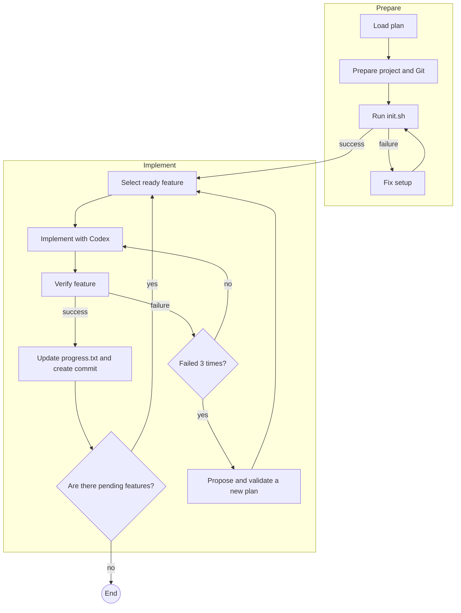

# Development Workflow

An MHL pipeline that uses the Codex CLI to implement, verify, and commit to Git a sequence of features defined by software specifications.

The workflow supports both new projects and existing applications. In a new project, the agent creates a minimal structure under `app/<descriptive-name>`. In an existing project, it attempts to preserve the structure and verification process already in use.

> [!WARNING]  
> execution grants Codex autonomy to create and edit files, run commands, and, after successful verification, stage and commit changes in the target repository. Run the workflow only in a version-controlled environment, and review the specifications and prompts beforehand.

## Overview



The pipeline processes at most 15 iterations and retains per-stage checkpoints for seven days. Each feature also has its own retry and replanning limits.

## Prerequisites

- [MHL CLI](https://github.com/mh-language/mhl-core-runtime) available as `mhl` on the `PATH`;
- [Codex CLI](https://github.com/openai/codex) installed and authenticated;
- Git and Bash;
- dependencies required by the target project;
- Docker running when the specifications depend on local services, such as the Postgres example included in this directory.

### Installing MHL

On macOS or Linux:

```bash
curl -fsSL https://raw.githubusercontent.com/mh-language/mhl-core-runtime/main/install.sh | sh
```

On Windows, run the following in PowerShell:

```powershell
irm https://raw.githubusercontent.com/mh-language/mhl-core-runtime/main/install.ps1 | iex
```

The installer downloads the [latest release](https://github.com/mh-language/mhl-core-runtime/releases), installs the executable in `~/.mhl/bin`—or `%LOCALAPPDATA%\mhl\bin` on Windows—and adds that directory to the `PATH`. If it finds VS Code, it also installs the `mhl-language` extension.

Open a new terminal and confirm the installation:

```bash
mhl version
```

The currently supported platforms are `linux-amd64`, `darwin-arm64` (macOS on Apple Silicon), and `windows-amd64`. See the [main README](../README.md#installing-mhl) for manual download and source-build options.

Validate the tools before getting started:

```bash
mhl version
codex --version
git --version
```

## Preparing the specifications

The `specs/` directory serves two purposes:

- `specs/active/`: approved documents used directly during execution;
- `specs/sources/`: source material concatenated and sent to the planner when no valid published plan is available.

By default, the workflow looks for:

- the plan at `specs/active/40-development-plan.json`;
- the software design at `specs/active/20-software-design-document.md`.

The files in the repository describe a task-management Web API built with .NET and Postgres and serve as a working example. To use a different project, replace the active specifications and their corresponding source files.

### Minimum plan contract

The plan must be a JSON object with a `features` list. Each feature must have a numeric identifier, priority, dependencies, traceable references, and enough context to be implemented independently:

```json
{
  "features": [
    {
      "id": 1,
      "title": "Create resource",
      "priority": 1,
      "dependsOn": [],
      "description": "The feature's intended behavior.",
      "references": ["FR-001", "AC-001"],
      "implementationContext": {
        "requirements": ["Applicable requirement"],
        "decisions": ["Applicable architectural decision"],
        "constraints": ["Applicable constraint"],
        "files": ["src/Feature.cs"],
        "acceptance": ["Verifiable criterion"]
      },
      "status": "pending"
    }
  ]
}
```

Dependencies must reference existing IDs and form an acyclic graph. By default, the workflow imports at most the first ten features, ordered by priority and ID.

## Running the workflow

Internal paths are relative to this directory. Therefore, run the commands from `mhl.workflow.development/`:

```bash
cd mhl.workflow.development
mhl lint .
mhl run main.mh
```

There are no required input parameters. To continue an interrupted run from its checkpoints:

```bash
mhl run main.mh --resume
```

## What happens during execution

1. **Start/Plan:** imports the published plan. If it is unavailable, Codex creates `specs/active/40-development-plan.json` from `specs/sources/`.
2. **Setup:** classifies the work as greenfield or brownfield, prepares a branch other than `main`/`master`, and determines `TARGET_DIR` and `VERIFY_CMD`.
3. **Bearings:** records the target directory, the end of `progress.txt`, and recent commits to orient the session.
4. **Smoke:** runs `<TARGET_DIR>/init.sh`. If it fails, Codex fixes only the bootstrap process, and the test is repeated.
5. **Pick:** selects the next pending feature whose dependencies have already been completed, respecting priority and ID.
6. **Implement:** sends only the feature context and relevant architectural decisions to a new Codex run.
7. **Verify:** runs `verify-feature.sh <feature-id>` or, as a fallback, the aggregate command configured in `VERIFY_CMD`.
8. **Fix/Replan:** requests a targeted fix after a failure. After the third consecutive failure, it may propose a complete, validated revision of the plan.
9. **Handoff:** marks the feature as complete, appends a line to `progress.txt`, runs `git add .`, and creates a commit in the target repository.

The commit follows this format:

```text
Feature #<id> - <title>: implementation completed [<result>]
```

## Target repository contract

During Setup, the agent must ensure that these files exist directly under `TARGET_DIR`:

| File | Responsibility |
| --- | --- |
| `init.sh` | Prepare dependencies, build, and, when necessary, start the application idempotently. It must exit with a nonzero status if the environment is not ready. |
| `verify-feature.sh` | Accept a feature ID and perform a real verification. It may run the full suite when there are no per-feature tests. |
| `progress.txt` | Maintain a concise history of delivered features. The handoff creates it if it does not already exist. |
| `logs/smoke.log` | Record the command and detailed output of the smoke test. |

`verify-feature.sh` must print a concise `PASS` or `FAIL` verdict, but the pipeline primarily considers the exit code. Empty verifiers or verifiers that always return success do not satisfy the contract.

## Configuration and generated state

MHL persists execution data in `.mhl/`, which is created in this directory. The main artifacts are:

| Path | Contents |
| --- | --- |
| `.mhl/run_config.json` | Target directory, verification command, and execution limits. |
| `.mhl/feature_list.json` | Current feature state. |
| `.mhl/plan_observations.json` | Evidence used during replanning. |
| `.mhl/plan_revision.json` | Temporary plan revision proposal. |
| `.mhl/session_trace.jsonl` | Session context and handoff events. |
| `.mhl/logs/codex.log` | Raw output from Codex CLI runs. |
| `.mhl/setup_schema.json` | Schema for the structured Setup response. |

The default limits defined in `modules/tools/run-config.tool.mh` are:

| Key | Default | Effect |
| --- | ---: | --- |
| `steps_per_feature` | `6` | Maximum number of implementation/verification cycles per feature. |
| `max_replans` | `2` | Maximum number of global plan revisions. |
| `max_features` | `10` | Maximum number of imported or retained features. |
| `docs_folder` | `specs/active` | Main directory for approved documents. |

`TARGET_DIR` and `VERIFY_CMD` are defined during Setup. The remaining values can be persisted in the `config` object within `.mhl/run_config.json` when a resumed run needs to be adjusted.

## Internal organization

```text
development-workflow/
├── main.mh
├── modules/
│   ├── agents/
│   │   ├── codex.agent.mh       # Codex command, arguments, and logs
│   │   ├── codex.adapter.mh     # execution and error handling
│   │   └── codex.schemas.mh     # structured response schemas
│   ├── prompts/
│   │   ├── setup.prompt.md
│   │   ├── plan.prompt.md
│   │   ├── implement.prompt.md
│   │   ├── fix.prompt.md
│   │   ├── replan.prompt.md
│   │   └── retry-smoke.prompt.md
│   └── tools/
│       ├── feature.tool.mh       # plan import, selection, and revision
│       ├── run-config.tool.mh    # persistent configuration
│       ├── smoke.tool.mh         # project bootstrap
│       ├── verify.tool.mh        # deterministic verification
│       ├── handoff.tool.mh       # progress and commit
│       ├── bearings.tool.mh      # concise repository context
│       ├── implement.tool.mh     # feature and design context
│       └── session.tool.mh       # session memory and tracing
└── specs/
    ├── active/
    └── sources/
```

## Troubleshooting

### `No pending features found`

Check whether `specs/active/40-development-plan.json` contains valid `features`. Also inspect `.mhl/feature_list.json` to determine whether they have all already been marked as complete.

### Pending but blocked features

The message `none are ready (blocked dependencies)` indicates missing or incomplete dependencies, or a cycle in the plan. Review the `dependsOn` fields in `.mhl/feature_list.json` and in the published plan.

### Recurring smoke-test failure

Read `<TARGET_DIR>/logs/smoke.log` and confirm that `init.sh` exists directly in the target directory, is idempotent, and includes all necessary dependencies.

### Codex does not return a result

Check the Codex CLI authentication and inspect `.mhl/logs/codex.log`. The adapter expects the JSON output produced by `codex exec --json`.

### No commit was created

The handoff does not create a commit when the target directory is not a Git repository, there are no staged changes, or the commit itself fails. The cause is recorded in the pipeline log; `progress.txt` is still updated on a best-effort basis.

## License

This workflow is part of the `mhl-workflows` repository, released under [CC0 1.0 Universal](../LICENSE).
