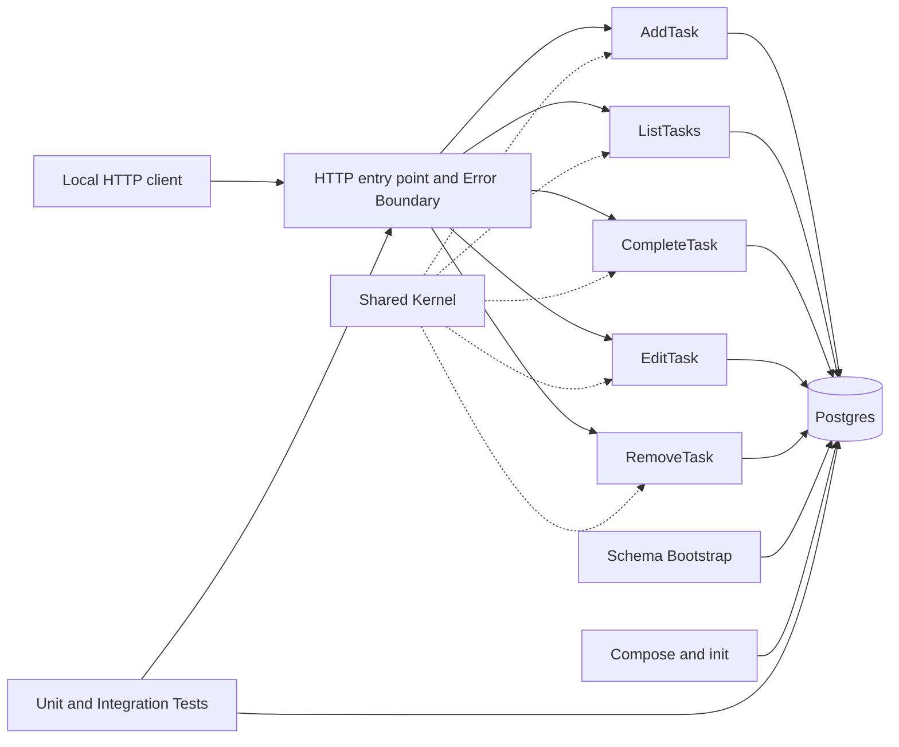
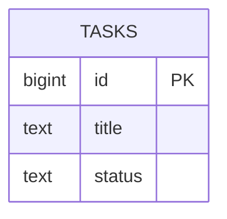

# Software Design Document

## 1. Architectural vision and principles

An ASP.NET Core Web API in .NET/C#, organized around Vertical Slice Architecture. Each operation contains its own HTTP adaptation, rule, and SQL. Sharing is limited to the entity/status, Postgres connection creation, and common errors. Principles: cohesion per use case; validation before mutation; parameterized SQL; public errors kept separate from diagnostics; external configuration; idempotent startup; real and reproducible verification; a local, greenfield boundary.

## 2. System context and boundaries

Local HTTP client → WebAPI → Postgres. The API runs on the development/test host; Docker Compose manages only Postgres and its volume. init.sh brings up and waits for the database and runs the test solution. There is no legacy data, frontend, identity, cloud, CI, or production.



## 3. Components and responsibilities

- **API Entry Point/Error Boundary:** registers routes, dispatches to the slice, serializes JSON and Problem Details, and sanitizes failures; contains no business rule or generic data access.
- **AddTask:** parses titulo, applies trimming and validation, sets pendente, inserts the record, and returns the task with Location.
- **ListTasks:** validates the filter, selects all tasks or those matching a status, and orders by id.
- **CompleteTask:** locates the task and updates its status idempotently.
- **EditTask:** validates the title before the update and preserves the status.
- **RemoveTask:** deletes by id and distinguishes a missing task.
- **Shared Kernel:** the conceptual Task, the status domain, NpgsqlDataSource or connection factory, and common errors; contains no endpoint-specific query or command.
- **Schema Bootstrap:** on API startup, runs the idempotent table definition before database-dependent routes serve requests.
- **Postgres/volume:** the source of truth and id generation.
- **Local orchestration:** Compose with one Postgres instance, volume, and healthcheck; an idempotent script.
- **Unit Tests:** pure rules extracted into internal functions or objects within each slice, with no HTTP or database involved.
- **Integration Tests:** xUnit, a test ASP.NET host, HttpClient, and a real Postgres; cleanup is exclusive per test case.

## 4. Interactions, flows, and dependencies

### Startup

Compose brings up Postgres and the healthcheck turns positive. The API creates an NpgsqlDataSource using TODO_DB_CONNECTION; Schema Bootstrap runs its idempotent definition; routes then start serving requests. A database failure reaches the Error Boundary and produces a sanitized 503.

### Operations

Request → slice → validation → parameterized SQL command → mapping → response. Validation completes before any mutable connection is used. Updates and deletes check affected-row counts to distinguish a 404. Listing applies the validated filter and orders by id. Completion sets concluida even if the task is already in that state.

### Verification

init.sh runs docker compose up -d --wait followed by the solution single command. Unit tests run with no dependencies. Integration tests are non-parallel; before each test case, the table is truncated and its sequence reset through a dedicated test connection. The API host is recreated for the persistence scenario while the database and volume remain in place.

Dependencies are a supported .NET LTS SDK pinned in the repository, ASP.NET Core, the Npgsql driver, xUnit, Postgres with a pinned image, and Docker Compose. Exact versions are recorded during initial implementation.

### 4.1 C#/.NET implementation instructions

The implementation uses the selected supported .NET LTS version and records the exact SDK in global.json. The solution and projects enable nullable reference types, implicit usings, deterministic builds, and appropriate compiler/analyzer warnings. Warnings are treated as errors in CI or verification once the baseline is clean; suppressions require documentation.

Recommended solution layout:

```text
app/
  TodoApp.sln
  Directory.Build.props
  global.json
  docker-compose.yml
  init.sh
  verify-feature.sh
  src/
    TodoApp.Api/
      Program.cs
      Features/
        AddTask/
        ListTasks/
        CompleteTask/
        EditTask/
        RemoveTask/
      Infrastructure/
        Database/
        Errors/
      Domain/
  tests/
    TodoApp.UnitTests/
      Features/
    TodoApp.IntegrationTests/
      Fixtures/
```

The vertical-slice boundary remains visible in the filesystem and namespaces. Program.cs is limited to composition: configuration, dependency registration, middleware, route mapping, and startup orchestration. It contains no feature-specific SQL or business rules.

#### Required dependencies and boundaries

ASP.NET Core supplies the Web API host, routing, JSON serialization, Problem Details, and dependency injection. Npgsql is the only database driver. One singleton NpgsqlDataSource or equivalent shared connection factory is registered, while each slice creates and disposes its own command and reader. xUnit, Microsoft.NET.Test.Sdk, and the test runner provide tests. Microsoft.AspNetCore.Mvc.Testing or an equivalent test host provides an in-process HttpClient. Postgres and Docker Compose provide the real database; an in-memory database, JSON file, or mock-only persistence path is not acceptable. Entity Framework Core, Dapper, MediatR, a generic repository, and a generic service layer are excluded unless a new ADR changes the design.

#### Slice implementation rules

Each feature folder contains the route or handler, request and response types, validation, SQL, and row mapping needed by that operation. A slice parses and validates input before opening a mutable database operation; normalizes titulo with Trim and rejects empty results; uses long for the public id and parameterized NpgsqlCommand values for every input; uses await, await using, and the request cancellation token; checks affected-row counts for update and delete; maps rows explicitly to id, titulo, and status; and keeps status values in shared constants or a small domain type while endpoint-specific rules stay in the owning slice.

Prefer typed minimal-API results or explicit IResult branches so 201, 200, 204, 400, 404, and 503 behavior is visible. Use Created with a Location header for creation and Problem Details for client and dependency errors. Never copy a raw exception, connection string, SQL statement, or driver message into an HTTP response.

#### Configuration and startup

Read TODO_DB_CONNECTION through IConfiguration and provide a documented local-development default only when the environment is explicitly local. Do not hardcode credentials in source, tests, or Compose. Register the data source once, run the schema bootstrap through an idempotent startup component, and expose database-dependent routes only after it completes. CREATE TABLE IF NOT EXISTS is suitable for this greenfield baseline; later schema changes require an explicit evolution strategy and ADR. Compose owns Postgres readiness, volume persistence, and the healthcheck. init.sh owns docker compose up -d --wait and the complete verification command and is safe to run repeatedly.

#### Testing and verification requirements

Unit-test validation, normalization, status transitions, and mapping without HTTP or a database. Integration-test the public HTTP contract with HttpClient and a real Postgres, including invalid input, missing ids, ordering, idempotent completion, API-host recreation, and sanitized 503 responses. Keep integration tests in a non-parallel xUnit collection. Truncate tasks and reset its identity sequence before each case; do not rely on ordering. Run the same solution-level command from verify-feature.sh that developers use locally. Any failure returns a non-zero exit code, and textual PASS output is not evidence of success. Credentials, task titles, and raw driver exceptions stay out of logs. Tests assert response bodies, status codes, and application/problem+json for errors.

Implementation is complete only when the pinned solution builds, the full unit and integration suite is green against the real Compose-managed Postgres, repeated init.sh runs are safe, and every endpoint has an executable verification path.

## 5. Conceptual data model

Logical table tasks:

- id: a positive 64-bit integer, primary key, generated as an identity by Postgres;
- title: required text, with a constraint rejecting an empty value after trimming;
- status: required text limited to pendente or concluida.

There is no user, date, priority, version, or audit column. Listing orders by id. DELETE physically removes the row. The volume retains data across API restarts; there is no external backup or retention.



## 6. Contracts and specification-level interfaces

- Creation and edit input: application/json JSON with a textual titulo field.
- Representation: an integer id, a normalized textual titulo, and status of pendente or concluida.
- Error: application/problem+json with type, title, status, detail, and instance; detail is public and sanitized.
- POST /tasks: 201, the task body, and Location pointing to the conceptual resource; 400 if invalid.
- GET /tasks: 200 array ordered by id; optional status query; 400 if invalid.
- PATCH /tasks/{id}/complete: 200 with the task; 404 if missing.
- PUT /tasks/{id}: 200 with the task; 400 if invalid; 404 if missing.
- DELETE /tasks/{id}: 204; 404 if missing.
- Unavailable dependency: 503 Problem Details.
- Persistence: each slice owns its parameterized SQL and requests a connection from the shared data source; there is no Repository.

## 7. Architectural decisions

The design records these decisions: ADR-001 uses vertical slices per endpoint because HTTP, rule, and data specifics are co-located; ADR-002 uses the mandatory .NET/C# and ASP.NET Core stack with a pinned LTS SDK; ADR-003 uses Npgsql directly for explicit commands and mapping; ADR-004 uses one Postgres in Docker Compose with a real volume and healthcheck; ADR-005 applies the initial schema idempotently at API startup; ADR-006 keeps a minimal shared kernel; ADR-007 uses xUnit at unit and integration levels; ADR-008 serializes integration tests with truncate and identity reset; ADR-009 uses environment-based configuration; and ADR-010 uses Problem Details and a canonical JSON contract with 503 for database failures.

## 8. Requirement allocation to components

| Target | Allocated requirements |
|---|---|
| Entry Point/Error Boundary | RF-1 to RF-5, RF-9, RF-10; RQ-4 |
| AddTask | RF-1; RQ-2, RQ-3, RQ-4 |
| ListTasks | RF-2, RF-3; RQ-2, RQ-3, RQ-4 |
| CompleteTask | RF-4; RQ-2, RQ-3, RQ-4 |
| EditTask | RF-5; RQ-2, RQ-3, RQ-4 |
| RemoveTask | RF-10; RQ-2, RQ-3, RQ-4 |
| Shared Kernel/configuration | RF-8; RQ-3, RQ-4 |
| Schema Bootstrap | RF-7; RQ-1 |
| Postgres/slice SQL | RF-1 to RF-8, RF-10; RQ-1, RQ-3, RQ-4 |
| Compose/init | RF-7, RF-8; RQ-1, RQ-2 |
| Unit/Integration Tests | RF-1 to RF-10; RQ-1, RQ-2, RQ-3, RQ-4 |

Every functional and quality requirement is allocated to an ADR below.

## 9. Approach to quality attributes

Correctness comes from invariants in rules and constraints, affected-row checks, and HTTP contract tests. Reliability comes from validation before mutation, idempotent bootstrap, readiness checks, and an aggregate result. Maintainability comes from one folder and namespace per endpoint, SQL local to each slice, and an auditable kernel. Reproducibility comes from pinned versions, Compose, environment configuration, and one script. There is no availability SLO, performance SLA, scale target, pagination requirement, backup guarantee, or strong concurrency requirement. Security and privacy use parameterization, external connection configuration, the Error Boundary, logs without titles or secrets, and local-only documentation.

## 10. Preliminary threat model

Assets are task integrity and availability, title content, and the connection string. Boundaries are client to API, API to Postgres, and environment to configuration. Injection is controlled by validation and Npgsql parameters. Partial mutation is controlled by validate-first processing and atomic commands. Error leakage is controlled by sanitized Problem Details. Credential exposure is controlled by environment configuration and redaction. Unauthorized access is bounded by local execution and documentation. DoS and volume loss remain local risks because limits, pagination, and backup are out of scope. Sensitive-title logging is prohibited by default.

## 11. Security controls tied to the SRS

SEC-001 is implemented by the Error Boundary mapping dependency exceptions without copying internal messages into Problem Details; tests inspect bodies and headers. SEC-002 uses TODO_DB_CONNECTION, a local default, and log redaction. SEC-003 validates and normalizes before commands and uses Npgsql parameters. SEC-004 has no identity component and documents local, non-production use. SEC-005 records route, status, correlation, and duration but never titulo or the request body.

## 12. Observability and operational needs

Local structured logs record start and end, bootstrap, perceived readiness, route template, status, duration, failure category, and suite results. They contain no payload, title, connection, or driver message. Operation requires the pinned .NET SDK and images, Docker Compose, local ports, a persistent volume, TODO_DB_CONNECTION, a healthcheck, an idempotent init.sh, and the solution command. The API must be recreatable while keeping the database for the persistence scenario.

## 13. Technical risks and future proof-of-concept points

Implementation must prove concurrent and repeatable bootstrap on an empty database and restart, Unicode title mapping and constraints, truncate/reset and non-parallelism, API-host recreation without restarting Postgres, Npgsql exception redaction and sanitized 503 behavior, and pinned supported versions. These are implementation criteria and do not expand the approved scope.

## 14. Boundary and handoff

Development may start the .NET solution, local Postgres infrastructure, schema bootstrap, minimal shared kernel, five endpoint slices, and the specified tests. It may choose and pin supported versions without changing the architecture. It may not add JSON migration, a frontend, identity, cloud or production deployment, multiple services, regulated-data support, pagination or SLA claims, or generic layers without a new refinement and ADR.

## Architecture Decision Records
- **ADR-001** [RF-1, RF-2, RF-3, RF-4, RF-5, RF-9, RF-10, RQ-3] Vertical slices per endpoint: Co-locate HTTP handling, validation, persistence SQL, mapping, and response construction for each task operation in its own feature slice. — rationale: This preserves cohesion and isolated evolution for the small API while accepting deliberate duplication; layered or generic Controller/Service/Repository abstractions would add coupling and indirection.
- **ADR-002** [RF-1, RF-2, RF-3, RF-4, RF-5, RF-6, RF-7, RF-8, RF-9, RF-10, RQ-1, RQ-2, RQ-3, RQ-4] .NET and ASP.NET Core: Implement the API in C\# on ASP.NET Core using a supported .NET LTS SDK pinned in global.json. — rationale: The stack is mandatory, mature, and supplies routing, JSON, Problem Details, dependency injection, and the local test-host integration point; exact versions are pinned during implementation.
- **ADR-003** [RF-1, RF-2, RF-3, RF-4, RF-5, RF-6, RF-8, RF-9, RF-10, RQ-3, RQ-4] Direct Npgsql access per slice: Register one singleton NpgsqlDataSource and let each slice execute its own parameterized commands and explicit row mapping. — rationale: Direct use keeps SQL and mapping with the operation that owns them, provides real Postgres fidelity, and avoids the generic abstractions and tracking conventions of Dapper or EF Core.
- **ADR-004** [RF-6, RF-7, RF-8, RQ-1, RQ-2] Single Postgres in Docker Compose: Use one pinned Postgres service with a persistent volume and healthcheck; Compose contains no API or other service. — rationale: A real database is required for persistence and integration fidelity. The local volume demonstrates API-only restart durability, while cloud, managed, and production infrastructure remain out of scope.
- **ADR-005** [RF-6, RF-7, RQ-1] Idempotent schema bootstrap at API startup: Run an idempotent initial tasks table definition through a startup component before database-dependent routes serve requests. — rationale: CREATE TABLE IF NOT EXISTS works against both a fresh database and an existing baseline without a mandatory migration tool. Any later schema evolution requires a new explicit strategy and ADR.
- **ADR-006** [RF-1, RF-2, RF-3, RF-4, RF-5, RF-6, RF-7, RF-8, RF-9, RF-10, RQ-3] Minimal shared kernel: Share only the Task representation, pendente/concluida status domain, data source or connection creation, and common error primitives. — rationale: Centralizing genuinely cross-cutting concerns avoids scattered configuration while preventing endpoint-specific rules and queries from becoming a shared layer.
- **ADR-007** [RF-1, RF-2, RF-3, RF-4, RF-5, RF-6, RF-7, RF-8, RF-9, RF-10, RQ-1, RQ-2, RQ-3, RQ-4] Two-level xUnit verification: Use pure unit tests for slice rules and mappings, plus real HTTP and real Postgres integration tests through an ASP.NET test host. — rationale: Unit tests provide fast diagnosis for pure behavior, while real integration tests prove the public contract, database behavior, schema, persistence, and dependency failures; mocks or an in-memory store cannot provide that proof.
- **ADR-008** [RF-1, RF-2, RF-3, RF-4, RF-5, RF-6, RF-7, RF-8, RF-9, RF-10, RQ-1, RQ-2] Serial integration isolation: Place integration tests in a non-parallel collection and truncate tasks plus reset its identity sequence before every test case using a dedicated connection. — rationale: This makes individual, suite, and repeated runs deterministic without relying on test order. A database per test is slower and a transaction cannot easily span the HTTP calls under test.
- **ADR-009** [RF-6, RF-7, RF-8, RF-9, RQ-1, RQ-4] Environment-based database configuration: Read TODO\_DB\_CONNECTION through configuration and use a documented local-only default only in the explicit local environment; redact secrets from logs. — rationale: The override supports reproducible local testing without committing credentials. A secret manager is outside the local baseline, so the boundary and limitations must remain explicit.
- **ADR-010** [RF-1, RF-2, RF-3, RF-4, RF-5, RF-8, RF-9, RF-10, RQ-2, RQ-4] Canonical JSON and Problem Details contract: Expose id, titulo, and status with pendente or concluida values; use the specified HTTP statuses, Location on creation, ordered lists, and sanitized application/problem+json errors including 503 for dependency failures. — rationale: A stable, interoperable contract makes client errors, missing resources, idempotent completion, deletion, and unavailable dependencies observable and testable without leaking internals.

## Controls
- **IC-001** [RF-1, RF-3, RF-4, RF-5, RF-9, RF-10, RQ-2, RQ-3, RQ-4] Validate before mutation: Parse and normalize titulo, validate status filters and identifiers, and reject invalid input before opening or executing a mutable database command.
- **IC-002** [RF-1, RF-2, RF-3, RF-4, RF-5, RF-6, RF-7, RF-10, RQ-3] Parameterized persistence: Use Npgsql parameters for every client value, explicit row mapping, Postgres constraints, affected-row checks, and request cancellation for database calls.
- **IC-003** [RF-8, RF-9, RQ-4] Sanitized error boundary: Map validation, not-found, and dependency failures to deterministic Problem Details without connection strings, credentials, stack traces, SQL, hostnames, or provider messages.
- **IC-004** [RF-8, RF-9, RQ-1, RQ-4] External configuration and redacted logging: Obtain the connection from TODO\_DB\_CONNECTION with a local-only documented default and log route, status, duration, and failure category without payloads, titles, credentials, or raw exceptions.
- **IC-005** [RF-6, RF-7, RF-8, RQ-1] Readiness and idempotent bootstrap: Make Compose health positive before verification, create the schema automatically, and allow repeated startup against an existing schema without manual setup.
- **IC-006** [RF-1, RF-2, RF-3, RF-4, RF-5, RF-6, RF-7, RF-8, RF-9, RF-10, RQ-1, RQ-2, RQ-3] Real isolated verification: Run pure unit tests and serial real-HTTP/real-Postgres integration tests, cleaning the table and identity sequence per case and returning failure when either suite fails.
- **IC-007** [RF-1, RF-2, RF-3, RF-4, RF-5, RF-6, RF-7, RF-8, RF-9, RF-10, RQ-1, RQ-3, RQ-4] Local-only boundary: Document that the unauthenticated API is for local development and demonstration only, with no production, external exposure, identity, regulated-data, backup, or availability claim.
